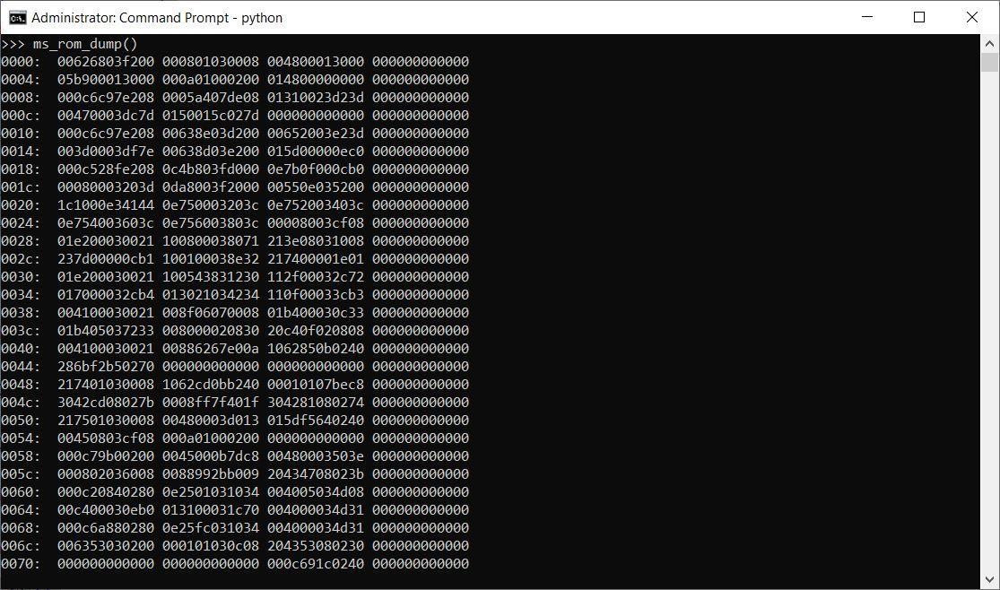
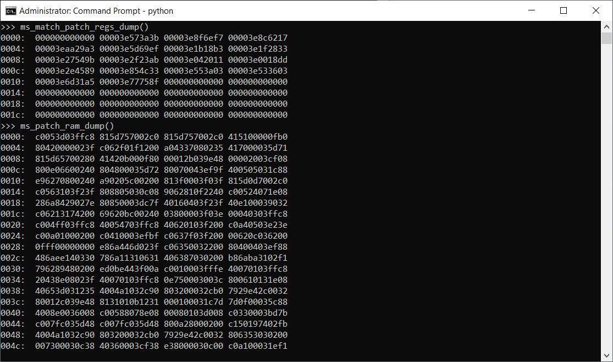

# **Disclaimer**

**All information is provided for educational purposes only. Follow these instructions at your own risk. Neither the authors nor their employer are responsible for any direct or consequential damage or loss arising from any person or organization acting or failing to act on the basis of information contained in this page.**

# Description
Five [Intel Microcode](https://en.wikipedia.org/wiki/Intel_Microcode) (uCode) Sequencer's arrays for Atom Goldmont core named according to our guesses:

**ms_rom.txt** - the first array of Microcode Sequencer, with triads of 48 bits micro-operations of the Intel Small Core

**ms_irom.txt** - the second read-only array which we think contains immediate used in msrom

**ms_patch_imm.txt** - immediates for ucode patch from patch RAM

**ms_match_patch.txt** - dump of 31 bits match/patch registers pairs. They refer directly to msrom with 0-15 bits of match register and 16-30 bits of patch register shifted right by one bit

**ms_patch_ram.txt** - extracted content of MS Patch RAM. It contains uops divided into four groups (1st is all first uops from each triad, 2nd - all second uops and so on). This data combined into triads can be found in msrom at 0x7c00 UIP

# Research Team

Mark Ermolov ([@\_markel___][1])

Maxim Goryachy ([@h0t_max][2])

Dmitry Sklyarov ([@_Dmit][3])

[1]: https://twitter.com/_markel___
[2]: https://twitter.com/h0t_max
[3]: https://twitter.com/_Dmit
